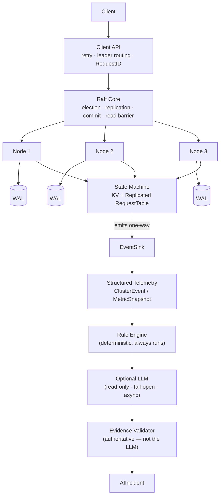
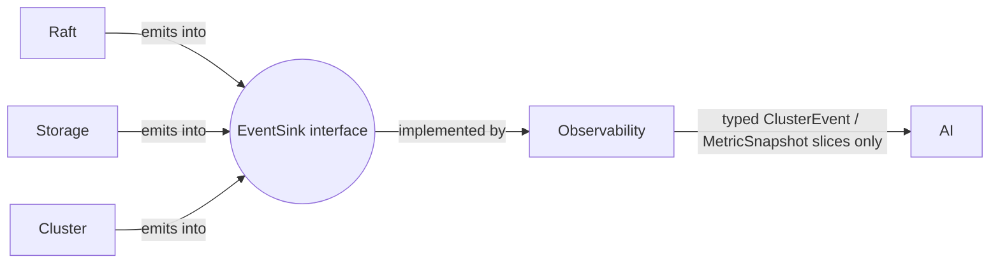
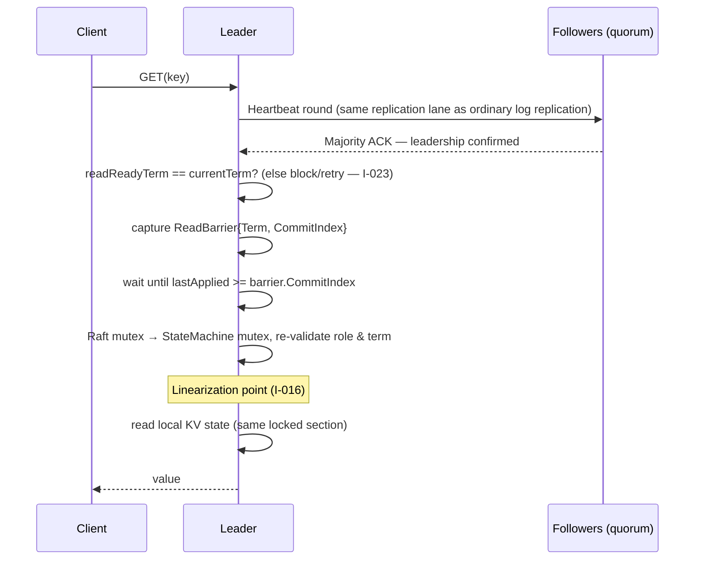
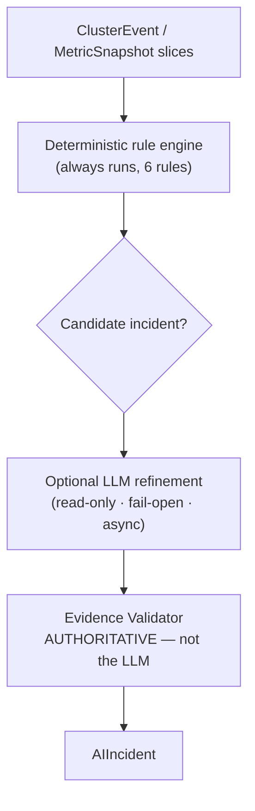

<div align="center">

# RaftKV

**A persistent, Raft-consensus-based distributed key-value store, built from scratch in Go.**

Deterministic fault-injection testing · WAL-based crash recovery · replicated idempotent writes · quorum-confirmed linearizable reads · an evidence-grounded AI incident-diagnosis layer structurally isolated from consensus.


-orange?style=flat-square)


</div>

> **Status:** 🚧 Actively implemented and tested. Phases 0–8 are complete and developer-approved; Phase 9 (AI Evaluation) is in progress. **[`PROGRESS.md`](PROGRESS.md) is the authoritative, pass-by-pass record of what's actually built and verified** — this README describes the target architecture and design; PROGRESS.md tracks day-to-day reality and may be ahead of what's reflected here.

---

## At a Glance

| | |
|---|---|
| 🧠 **Consensus** | Raft, implemented from scratch (no `hashicorp/raft`, no `etcd/raft`) — see [ADR-002](docs/adr/002-raft-from-scratch.md) |
| 🛡️ **Safety invariants** | 24, canonically IDed `I-001`–`I-024` — all 24 currently have a passing test (see `PROGRESS.md`'s invariant coverage tracker) |
| 🧪 **Test hierarchy** | 5 levels — deterministic unit tests through OS-level chaos — all exercised and race-clean through Phase 8 |
| 🗺️ **Implementation phases** | 11 total — Phases 0–8 approved, Phase 9 (AI Evaluation) in progress, Phase 10 not started |
| 📜 **Architecture Decision Records** | 9, doubling as interview material |
| 🤖 **AI evaluation** | 8 primary + 4 held-out anti-circularity scenarios; 0 evidence-validator rejections across live-LLM-backed runs so far |
| 💥 **Chaos scenarios** | 11 named deterministic scenarios (including real `SIGKILL` process-crash tests), plus a seeded 30-minute randomized fuzzer |
| 🎯 **Primary purpose** | Interview artifact (SDE / backend / distributed systems) + a readable, test-covered Raft reference |

---

## Table of Contents

- [Why This Project](#why-this-project)
- [What Makes This Different](#what-makes-this-different)
- [Tech Stack](#tech-stack)
- [Architecture](#architecture)
- [Client API](#client-api)
- [Core Safety Guarantees](#core-safety-guarantees)
- [Failure Model & Non-Guarantees](#failure-model--non-guarantees)
- [The AI Layer — Read-Only, Evidence-Grounded](#the-ai-layer--read-only-evidence-grounded)
- [Testing Strategy](#testing-strategy)
- [Key Design Decisions](#key-design-decisions)
- [Project Status](#project-status)
- [Phase Roadmap](#phase-roadmap)
- [Known Limitations (By Design)](#known-limitations-by-design)
- [Repository Layout](#repository-layout)
- [Documentation Map](#documentation-map)
- [Development Workflow](#development-workflow)
- [Non-Goals](#non-goals)
- [Getting Started](#getting-started)
- [License](#license)

---

## Why This Project

Most portfolio "distributed systems" projects are either a REST API glued onto a database, or a Raft implementation that has never actually been made to survive a killed leader, a network partition, or a crash-restart.

**RaftKV closes that gap.** Every safety, recovery, and consistency claim this project makes is backed by a canonical invariant ID (`docs/invariants.md`), a targeted test designed to fail if that property is violated, and — where applicable — a chaos scenario that exercises it under adversarial conditions.

**Core use cases:**
- Normal writes/reads against a 3–5 node cluster
- Leader crash → automatic election
- Network partition → provable minority-cannot-commit behavior
- Node crash → WAL recovery and rejoin
- Operator (or the AI layer) diagnoses cluster health from structured telemetry alone

---

## What Makes This Different

Getting past leader election into **WAL persistence + crash recovery + chaos-proven fault tolerance + a correctly-specified linearizable read path** is exactly where most student Raft implementations stop short. Two places in particular are where the "obvious" implementation is subtly wrong — and where this project's own documentation and audit history record *why* the correct version looks the way it does:

1. **The read-barrier + new-leader no-op requirement.** Quorum leadership confirmation alone does not make a read safe — a freshly elected leader's `commitIndex` can still be behind what was actually committed before it, and the fix (`I-023`) has to be an explicit gate, not an implicit side effect of the ordinary read barrier.
2. **The replicated-dedup design.** A local per-node dedup cache cannot survive a leader crashing between commit and client-ack — deduplication has to live in the replicated state machine itself (`I-017`).

The AI diagnosis layer is not a chatbot bolted onto logs — it never touches consensus, never sees raw logs, and reasons only over a typed, versioned telemetry schema that a deterministic rule engine partially interprets first. Its architectural boundary is enforced by a compile-time AST import linter, not a code-review convention.

---

## Tech Stack

| Layer | Choice | Why |
|---|---|---|
| Language | **Go** | Goroutines make the concurrency model natural to express, mitigated by an explicit single-mutex-per-node discipline |
| RPC | **gRPC + Protocol Buffers** | Typed RPC contracts "for free" — the project's value is demonstrating protocol correctness, not inventing a wire format |
| Persistence | **Custom length-prefixed, checksummed WAL** | Full control over the crash-consistency contract (`docs/adr/003-wal-design.md`) |
| Testing | **Injectable `Clock`/`Transport` + single-threaded simulator** | Deterministic, sub-millisecond, 100+-repeat tests instead of flaky real-timer tests (`docs/adr/006-deterministic-testing.md`) |
| AI layer | **In-process rule engine + optional LLM** (evaluated live against Gemini in Phase 9) | No separate service/IPC surface to build or document; the architectural boundary is compile-time, not deployment-time (`docs/ai-design.md`) |

Full rationale for each choice — including rejected alternatives — lives in [`docs/adr/`](docs/adr/).

---

## Architecture

### System overview



### The hard architectural boundary — dependency direction



`internal/observability` depends **only** on the `EventSink` interface — never a concrete `Node`/`StateMachine`/`Storage` type. `internal/ai` depends **only** on `internal/observability`'s typed surface. This is a compile-time, structurally-enforced property (`I-015`) — checked in CI via `internal/ai`'s AST import linter (`imports_test.go`), not a code-review convention.

### The critical path is synchronous; AI is not

```
Client request → Raft → commit/apply → respond to client        (synchronous, on the critical path)
                              │
                              └──► emit ClusterEvent → Observability → AI   (fully async, never blocking)
```

A client write or read **never** waits on the AI layer, for any reason — verified structurally in Phase 8, including a test that terminates the in-process AI worker mid-chaos-scenario and confirms zero effect on cluster operation.

### Linearizable read protocol



### Concurrency model

| State | Owner | Lock |
|---|---|---|
| `currentTerm`, `votedFor`, `log[]`, `commitIndex`, `lastApplied`, `role` | Raft state | Raft mutex |
| `nextIndex[]` / `matchIndex[]`, `readReadyTerm`, `leaderNoOpIndex` | Leader-only volatile | Raft mutex |
| `KV`, `RequestTable` | State machine | `StateMachine.RWMutex` (write on apply, read on `GET`) |

**Fixed lock order, never reversed:** Raft mutex → StateMachine mutex. This is what makes the read protocol's linearization point (`I-016`) actually true rather than just documented — no write can land in the gap between "revalidated I'm still leader" and "read the KV state." Disk I/O is intentionally allowed under the Raft mutex (a documented MVP trade-off, [ADR-005](docs/adr/005-concurrency-model.md)); network I/O never is (`I-014`, verified under real concurrent-mutex-availability probes in Phase 6).

<details>
<summary><b>Frozen constants & vocabularies</b> (click to expand)</summary>

| Constant | Value |
|---|---|
| Heartbeat interval | `50ms` |
| Election timeout | randomized in `[250ms, 400ms]` per attempt |
| Quorum | `⌊N/2⌋ + 1` (3 nodes → 2, 5 nodes → 3) |
| Max key size | 1 KB |
| Max value size | 256 KB |
| Max single command size | ~257 KB |
| Max WAL record size | 1 MiB |
| Max entries per AppendEntries batch | 1000, or a byte-size cap, whichever binds first |
| Frozen metric names | `leader_changes_total`, `append_entries_failures_total`, `replication_lag`, `commit_latency`, `election_duration`, `node_up` |

These are frozen deliberately (`docs/architecture.md`) so an AI coding tool — or a second engineer — can't independently pick different values across files.

</details>

---

## Client API

```go
Set(key, value, request_id) -> SUCCESS | error
Delete(key, request_id)     -> SUCCESS | error
Get(key)                    -> value, found
ClusterStatus()             -> {leader, term, nodes: [{id, role, lastContact}]}
```

<details>
<summary><b>Result semantics</b> (click to expand)</summary>

| Result | Meaning | Retry? |
|---|---|---|
| `SUCCESS` | Command definitely committed and applied | No |
| `NOT_LEADER` | Not the leader; response includes a `leader_hint` if known | Yes, against the hinted leader |
| `NO_LEADER` | No known leader; response includes a `retry_after` hint | Yes, with backoff |
| `TIMEOUT` | **Outcome unknown** — including the case where the entry was superseded before commit | **Yes, with the SAME `request_id`** |
| `INVALID_REQUEST` | Malformed or oversized request | No |
| `REQUEST_ID_REUSED` | Same `request_id`, different payload (compared by hash) | No |
| `OVERLOADED` | Leader has too many outstanding writes in flight | Yes, with backoff |

**The critical rule:** `TIMEOUT` is never treated as a failure. A client library built against this API never needs to distinguish "true timeout" from "my write got superseded" — both produce `TIMEOUT`, and the safe response is identical: retry with the same `request_id`.

</details>

---

## Core Safety Guarantees

RaftKV enforces **24 canonical invariants** (`docs/invariants.md`) — 8 classic Raft safety proofs plus 16 implementation-specific safety properties unique to this codebase. **All 24 currently have a passing test** — see `PROGRESS.md`'s invariant coverage tracker for the exact test/phase mapping. Selected highlights:

| ID | Guarantee |
|---|---|
| `I-001`–`I-008` | The core Raft safety proofs: Election Safety, Leader Append-Only, Log Matching, Leader Completeness, State Machine Safety, Current-Term Commit Rule, Term Monotonicity, minority-cannot-independently-commit |
| `I-012` / `I-020` / `I-024` | `currentTerm`/`votedFor`/`bootID` are durably, atomically persisted (temp-file → fsync → rename → directory-fsync) — corrupt or ambiguous state on disk means the node **refuses to start**, never guesses |
| `I-013` / `I-018` | A follower's write only counts once its *own* WAL fsync completes; any durable-write failure fails the node **closed** (no ACK, no vote, no commit advance) |
| `I-016` | A linearizable read requires quorum leadership confirmation **+** an apply-barrier wait **+** term/role revalidation performed under the StateMachine lock, immediately before returning |
| `I-019` | Write completion is **request-identity-aware**, never index-only — a client write never resolves `SUCCESS` just because its original log index got applied by *someone else's* entry |
| `I-021` | Stale/out-of-order AppendEntries responses are rejected via `role == Leader` + `term == currentTerm` + a per-follower monotonic attempt counter — the at-most-one-in-flight rule alone is *not* sufficient |
| `I-023` | A newly elected leader commits **and applies** a no-op entry in its own current term — gated by an explicit `readReadyTerm` marker — before serving *any* linearizable read |

<details>
<summary><b>Full invariant table (I-001 – I-024)</b> (click to expand)</summary>

**Raft safety invariants** (from the Raft paper's own correctness argument):

| ID | Invariant | Statement |
|---|---|---|
| I-001 | Election Safety | At most one leader per term |
| I-002 | Leader Append-Only | A leader never overwrites or deletes entries in its own log — only appends |
| I-003 | Log Matching | Same index + term ⇒ identical entries, and all preceding entries also identical |
| I-004 | Leader Completeness | A committed entry from term T appears in every leader's log for all terms > T |
| I-005 | State Machine Safety | If two nodes applied an entry at the same index, it's the same entry |
| I-006 | Current-Term Commit Rule | A leader only concludes commitment via majority replication for its **current**-term entries |
| I-007 | Term Monotonicity | `currentTerm` never decreases, on any of the four term-change touchpoints |
| I-008 | Minority Cannot Independently Advance Commit | A minority partition cannot establish new commitment on its own |

**Implementation safety properties** (must hold in this codebase specifically):

| ID | Property |
|---|---|
| I-009 | `lastApplied ≤ commitIndex`, always |
| I-010 | `commitIndex ≤ lastLogIndex`, always |
| I-011 | Committed entries are never truncated |
| I-012 | `currentTerm`/`votedFor` durable, persisted together atomically, before any dependent RPC |
| I-013 | A follower's replication only counts after its own WAL fsync completes |
| I-014 | No network I/O — direct or indirect — while holding the Raft mutex |
| I-015 | The AI layer cannot mutate Raft state, WAL, KV state, or trigger elections/restarts/kills |
| I-016 | A linearizable read requires quorum confirmation + barrier wait + term/role revalidation |
| I-017 | A duplicate `RequestID` with a different payload is rejected, never silently resolved |
| I-018 | Storage durability failure ⇒ the node fails closed |
| I-019 | A pending write never resolves `SUCCESS` solely because its original index became applied |
| I-020 | Corrupt or ambiguous durable term/vote state causes startup failure, never guessed recovery |
| I-021 | A stale or out-of-order AppendEntries response is never applied to `nextIndex`/`matchIndex` |
| I-022 | `commitIndex`/`lastApplied` are monotonic non-decreasing during normal execution |
| I-023 | A new leader commits+applies a current-term no-op before serving any linearizable read |
| I-024 | `TermVoteStore` record replacement is crash-atomic; an orphaned temp file is never promoted |

Every ID has a defined enforcement mechanism and a passing test — `PROGRESS.md`'s invariant coverage tracker is the exhaustive, continuously-updated source of truth for exactly which phase implemented it and which test proves it.

</details>

---

## Failure Model & Non-Guarantees

**Assumptions:** an asynchronous, unreliable network (messages may be delayed, dropped, duplicated, or reordered); crash-stop/omission node failures. Correctness never depends on any assumed bound on message latency.

**Explicitly out of scope:** Byzantine failures, disk corruption beyond what CRC32 can detect, and any cross-node clock-synchronization assumption.

**What this system does *not* guarantee:**
- Exactly-once client delivery — it guarantees **at-most-once state-machine effect per `RequestID`**, a precise and weaker claim than "exactly-once," and a more honest one
- Availability without a leader that can reach a quorum (deliberate **CP**, not **AP**, per CAP)
- Byzantine fault tolerance
- Durability stronger than the underlying filesystem's own fsync guarantees

**Failure matrix (abridged):**

| Failure | Quorum reachable? | Writes | Reads | Outcome |
|---|---|---|---|---|
| Follower crash | Yes | Continue | Continue | Unaffected |
| Leader crash | Yes | Brief interruption | Brief interruption | New leader eventually elected (convergence time *measured*, never promised as a fixed bound) |
| Minority partition (1 of 3, 2 of 5) | Yes | Continue on majority | Continue on majority | Minority cannot independently commit (`I-008`) |
| Majority partition (2 of 3, 3 of 5) | No | Fail/block | Fail/block | CP behavior — no side has a leader-reachable quorum |
| AI/LLM service down | Yes (unrelated) | Unaffected | Unaffected | AI diagnosis unavailable only — fully async |

Full assumptions, safety-vs-liveness framing, and resource bounds in [`docs/failure-model.md`](docs/failure-model.md).

---

## The AI Layer — Read-Only, Evidence-Grounded



**Design principles:**

- 🔒 **Structurally read-only.** `internal/ai` has no import path to `internal/raft`, `internal/storage`, or `internal/cluster` — enforced by a compile-time AST import linter (`imports_test.go`), not a code-review convention (`I-015`, [ADR-008](docs/adr/008-ai-read-only.md)).
- ⚡ **Fully asynchronous.** Runs **in-process** as a worker goroutine, not a separate service — a client request never waits on it, and a test that terminates the AI worker mid-chaos-scenario confirms zero effect on cluster operation.
- 🧾 **Evidence-grounded, mechanically.** Every claim in an accepted `AIIncident` must resolve to a real `EventID` in the supplied telemetry window. `OBSERVATION` claims must satisfy both entity *and* semantic derivability against their cited events — a gap caught and closed during Phase 8's audit pass, where an entity-match-alone bypass would have let a hallucinated claim through. The validator, not the model, constructs the final `EvidenceRef` from the canonical event.
- 🎯 **The LLM proposes the complete diagnosis** (`IncidentType`, `Severity`, `AffectedNodes`, `Confidence`), not just narrative text — because Phase 9's evaluation scores exactly those fields, and scoring them means the LLM has to actually produce them ([ADR-007](docs/adr/007-rules-llm-hybrid.md)).
- 📊 **Honestly evaluated, against a live model.** 8 primary scenarios + 4 held-out anti-circularity variants + a 30-minute healthy-cluster control, scored via `--mode=recorded` fixtures — including live-captured Gemini responses — as the official, reproducible evaluation path. **0 of 12 live-LLM-backed scenarios rejected by the evidence validator so far**; the manual `SUPPORTED`/`UNSUPPORTED`/`UNCERTAIN` audit of the resulting `INFERENCE` claims is in progress (Phase 9).
- 🚫 **Never autonomous.** `RecommendedActions` are labeled informational-only everywhere they're displayed — the AI layer suggests, it never acts.

Full architecture, claim schema, and evaluation methodology in [`docs/ai-design.md`](docs/ai-design.md).

---

## Testing Strategy

A **five-level deterministic hierarchy**, because randomized election timeouts are correct in production but make naive tests flaky:

| Level | What it is | What it catches |
|---|---|---|
| **1** | Unit tests, fake `Clock` + fake `Transport` | Pure logic bugs — no `time.Sleep`, ever |
| **2** | Deterministic multi-node cluster via a single-threaded simulator | Cross-node sequencing bugs, without real-timing nondeterminism |
| **3** | Fault-injection transport (drop/delay/partition), same simulator | Replication/recovery correctness under seed-reproducible adversarial conditions |
| **4** | Real multi-process cluster, real gRPC, real scheduling | Genuine concurrency bugs — mutex races, deadlocks — Levels 1–3 cannot produce by construction |
| **5** | Docker/OS-level chaos | Final-mile realism, 30-min fuzzer soak, real `SIGKILL` process-crash tests |

**Explicit caveat:** passing every deterministic test proves protocol logic is correct under controlled event ordering — it does **not** prove the absence of races or deadlocks. That's exactly why Level 4 and `go test -race ./...` remain mandatory, not optional, at every phase.

Standing requirements — **verified through Phase 8 so far** (see `PROGRESS.md` for the exact per-phase race-detector run log):
- Safety properties are asserted as **hard invariants**; liveness properties are measured as bounded-time distributions (p50/p95/p99), never as fixed pass/fail thresholds.
- A 30-minute seeded chaos fuzzer run is reported as *"zero observed invariant violations under this specific run"* — never oversold as a formal correctness proof.
- `go test -race ./...` must be green after **every single phase**, not just at the end.

Full test hierarchy, fixture rules, and required test lists in [`docs/testing.md`](docs/testing.md).

---

## Key Design Decisions

<details>
<summary><b>All 9 ADRs, summarized</b> (click to expand — full rationale and rejected alternatives in <code>docs/adr/</code>)</summary>

| ADR | Decision | Why |
|---|---|---|
| 001 | Go + gRPC + Protocol Buffers | Typed RPC contracts "for free"; the project's value is protocol correctness, not wire-format invention |
| 002 | Raft implemented from scratch | The point is implementation-level understanding for interviews, not the fastest path to a working KV store |
| 003 | Length-prefixed, checksummed WAL; stop-and-truncate recovery | Reliable torn-write detection without a segmented/compacting WAL |
| 004 | Quorum-confirmed reads + new-leader no-op (not ReadIndex/lease) | Achieves the same correctness property using only mechanisms already in scope |
| 005 | Two mutexes (Raft + StateMachine), fixed lock order | Avoids serializing `GET` behind all Raft bookkeeping, at the cost of a lock-ordering discipline |
| 006 | Injectable `Clock`/`Transport` + 5-level test hierarchy | Deterministic, sub-millisecond, 100+-repeat election tests instead of flaky real-timer tests |
| 007 | Rules-first, LLM-on-top hybrid diagnosis | Rules give a grounded floor; the LLM adds narrative richness on the same evidence substrate |
| 008 | AI layer is strictly read-only | An AI hypothesis should never be trusted enough to act on autonomously in a consensus system |
| 009 | UUID `RequestID`s (not `(ClientID, SeqNum)`) | Simpler client library, at the accepted cost of unbounded `RequestTable` growth |

</details>

---

## Project Status

RaftKV is under active development. **[`PROGRESS.md`](PROGRESS.md) is the authoritative, continuously-updated, pass-by-pass record of what's actually built and verified** — the phase table below reflects the last known state and may lag behind it.

| Phase | Name | Status |
|---|---|---|
| 0 | Foundation + Single-Node KV Store | ✅ Approved |
| 1 | Leader Election + Heartbeats | ✅ Approved |
| 2 | Replicated Log + Minimal Durable Log | ✅ Approved |
| 3 | Commit, Apply, and Reads | ✅ Approved |
| 4 | Crash Recovery + Durable Metadata + WAL Hardening | ✅ Approved |
| 5 | Client Semantics + Replicated Dedup | ✅ Approved |
| 6 | Chaos Testing Framework | ✅ Approved |
| 7 | Observability | ✅ Approved |
| 8 | Evidence-Grounded Incident Diagnosis | ✅ Approved |
| 9 | AI Evaluation | 🔄 In progress |
| 10 | Benchmarking, Hardening & Final Demo | ⏳ Not started |

Across Phases 0–8: all 24 invariants (`I-001`–`I-024`) are implemented with a passing test, the full suite is verified with `go test -race ./...` after every phase with zero data races, and the chaos framework grew to **11 named deterministic scenarios** — beyond the 6 originally scoped — plus real subprocess `SIGKILL` crash-recovery tests. See `PROGRESS.md`'s invariant coverage tracker for the exhaustive per-invariant breakdown, and its per-phase checkpoint summaries for every audit finding and fix along the way.

---

## Phase Roadmap

The phase sequence and each phase doc's scope/exit-criteria are **authoritative** — a day-by-day calendar is useful for personal planning but is never grounds for compressing a phase's scope (especially Phases 2–4, where the project's real correctness content lives). This table describes what each phase covers by design; see [Project Status](#project-status) above for current completion state.

| Phase | Name | Focus |
|---|---|---|
| 0 | Foundation + Single-Node KV Store | Repo scaffold, in-memory KV over gRPC, no Raft yet |
| 1 | Leader Election + Heartbeats | Roles, terms, durable `TermVoteStore` from day one |
| 2 | Replicated Log + Minimal Durable Log | AppendEntries, conflict resolution, stale-response protection |
| 3 | Commit, Apply, and Reads | **The correctness core** — commit rule, apply loop, full linearizable read protocol, new-leader no-op |
| 4 | Crash Recovery + Durable Metadata + WAL Hardening | Full WAL corruption handling, crash-atomic term/vote storage |
| 5 | Client Semantics + Replicated Dedup | Result semantics, replicated idempotency, canonical command hashing |
| 6 | Chaos Testing Framework | Fault injection, 11 named deterministic scenarios (incl. real `SIGKILL` crash tests), 30-min randomized fuzzer |
| 7 | Observability | Structured `ClusterEvent`/`MetricSnapshot` telemetry, live buffer + scenario recorder |
| 8 | Evidence-Grounded Incident Diagnosis | Rule engine + LLM + evidence validator |
| 9 | AI Evaluation | 8 primary + 4 held-out scenario ground-truth harness, honest multi-metric report |
| 10 | Benchmarking, Hardening & Final Demo | Real measured numbers, soak test, 10 rehearsed live demos |

Each phase has its own self-contained spec at `docs/phases/phase-NN.md`, listing exactly which invariant IDs it touches, which files it's allowed to change, and its exit criteria.

---

## Known Limitations (By Design)

Stated explicitly rather than discovered later — every one of these is a documented, deliberate MVP scope boundary, not an oversight:

- **No snapshotting.** Recovery time is `O(committed log length)`. The design is fully documented (`docs/architecture.md`'s Snapshot Design) but intentionally not implemented in the Phase 0–10 MVP.
- **`RequestTable` grows unboundedly.** A consequence of UUID-based `RequestID`s ([ADR-009](docs/adr/009-request-identity-model.md)); bounded retention via snapshotting or session-based identity is future work.
- **No ReadIndex or leader-lease reads.** Quorum-confirmed reads via a new-leader no-op commit achieve the same guarantee using only mechanisms already in scope ([ADR-004](docs/adr/004-read-consistency.md)).
- **No cluster membership changes, sharding, multi-Raft, or transactions.** Explicitly flagged in `AGENTS.md`'s do-not-overbuild list — each is individually impressive-sounding, which is exactly why it's excluded from this project's actual differentiator.
- **No Byzantine fault tolerance, no clock-sync assumptions.** Out of scope by `docs/failure-model.md`.
- **A 30-minute chaos soak is not a correctness proof.** It's reported as *"zero observed invariant violations in this specific run"* — a finite randomized test demonstrates absence of observed violations, not a formal guarantee.

---

## Repository Layout

```
.
├── cmd/
│   ├── raftkv-node/          gRPC server entrypoint for a single cluster node
│   ├── raftkv-cli/           client CLI — get / set / delete / cluster status
│   └── raftkv-chaos/         chaos-scenario and fuzzer runner
├── internal/
│   ├── raft/                 election, replication, commit/apply, read protocol
│   ├── storage/               WAL, LogStore, TermVoteStore, KV state machine
│   ├── cluster/                transport, cluster config
│   ├── client/                 client-facing API, leader routing, retries
│   ├── chaos/                  fault-injecting transport, named scenarios, fuzzer
│   ├── observability/          ClusterEvent/MetricSnapshot emission, live buffer, scenario recorder
│   └── ai/                     rule engine, LLM client, evidence validator, incident types
├── proto/                     gRPC service + message definitions
├── tests/
│   ├── ai_eval/                Phase 9 evaluation harness, fixtures, recorded LLM responses
│   └── bench/                   Phase 10 benchmark suite
├── docs/
│   ├── PRD.md                 product definition, architecture pointers, phase roadmap (authoritative)
│   ├── architecture.md        system diagrams, write path, recovery path, WAL format, concurrency model
│   ├── invariants.md          canonical invariant IDs (I-001..I-024)
│   ├── failure-model.md       network/node failure assumptions, safety vs. liveness, failure matrix
│   ├── client-semantics.md    result semantics, replicated idempotency/dedup design, read protocol
│   ├── ai-design.md           evidence-grounded incident diagnosis: architecture, schema, evaluation
│   ├── testing.md               5-level deterministic test hierarchy, testing pyramid
│   ├── benchmarks.md            Phase 10 measured results
│   ├── demos.md                  10 demo scenarios
│   ├── interview-prep.md         question bank, cross-referenced against invariant IDs
│   ├── phases/                    phase-00.md .. phase-10.md — one self-contained spec per phase
│   └── adr/                        001–009 — architecture decision records
├── AGENTS.md                  binding development rules for any implementation session, human or AI
├── PROGRESS.md                 live, pass-by-pass status of every phase — source of truth for "what's done"
└── README.md                   you are here
```

---

## Documentation Map

| Document | Answers |
|---|---|
| [`docs/PRD.md`](docs/PRD.md) | What is this project, who is it for, what's the roadmap? |
| [`AGENTS.md`](AGENTS.md) | What rules govern every commit — the five-pass workflow, phase discipline, source-of-truth hierarchy |
| [`PROGRESS.md`](PROGRESS.md) | What's actually done right now, pass-by-pass — the up-to-date complement to this README's higher-level roadmap |
| [`docs/architecture.md`](docs/architecture.md) | How is it actually built — wire protocol, WAL format, concurrency model, recovery path |
| [`docs/invariants.md`](docs/invariants.md) | What must never be violated, and how each property is verified |
| [`docs/failure-model.md`](docs/failure-model.md) | What failures are assumed, what's explicitly out of scope, safety vs. liveness |
| [`docs/client-semantics.md`](docs/client-semantics.md) | What the client actually sees — result codes, idempotency, the read protocol |
| [`docs/ai-design.md`](docs/ai-design.md) | How the AI layer reasons, and why it can be trusted not to hallucinate silently |
| [`docs/testing.md`](docs/testing.md) | How correctness is actually verified, level by level |
| [`docs/adr/`](docs/adr/) | Why each major decision was made, and what alternatives were rejected |
| [`docs/interview-prep.md`](docs/interview-prep.md) | Question bank mapped to invariant IDs |

### Source-of-truth hierarchy

When two documents disagree, `AGENTS.md` resolves it in this fixed order:

```
1. AGENTS.md                 — implementation constraints
2. docs/invariants.md        — safety invariants (canonical IDs)
3. docs/phases/phase-NN.md   — current-phase scope
4. docs/architecture.md      — architecture / wire protocol / data structures
5. docs/client-semantics.md  — client contract
6. docs/failure-model.md     — failure assumptions
7. docs/ai-design.md         — AI contract
8. docs/adr/*.md              — rationale / history (informative, not binding)
```

A disagreement between two documents is treated as a **documentation bug**, never a judgment call to resolve silently.

---

## Development Workflow

Every phase — human or AI-assisted — follows the same five-pass discipline defined in `AGENTS.md`:

```
PASS 1 — DESIGN     read the docs, inspect existing code, explain the approach, list files to touch
PASS 2 — IMPLEMENT  build only what Pass 1 approved
PASS 3 — AUDIT      compare the implementation against every relevant invariant — no fixes yet
PASS 4 — FIX        write a failing test for each issue found, then fix only those issues
PASS 5 — VERIFY     go test ./...  &&  go test -race ./...  — report honestly, then STOP
```

Development never proceeds to the next phase without explicit developer approval, and never implements anything from a future phase "while we're at it" — see `AGENTS.md`'s scope-discipline rules for the full do-not-overbuild list. `PROGRESS.md` is the running, pass-by-pass log this workflow produces for every phase completed so far, including every audit finding and its fix.

---

## Non-Goals

- ❌ Not a production database — no sharding, no SQL, no secondary indexes
- ❌ Not competing with etcd/TiKV on throughput
- ❌ Not a chatbot over logs — the AI layer is a narrowly-scoped, evidence-bound diagnosis component
- ❌ No cluster membership changes, transactions, leases, or ReadIndex in the MVP (all documented as deliberate future work)
- ❌ No AI-driven autonomous remediation, ever — the AI layer cannot act, only suggest

---

## Getting Started

### Clone & Build

```bash
git clone <this-repo>
cd raftkv
go build ./...
go vet ./...
```

### Run the Test Suite

```bash
go test ./...
go test -race -count=1 -timeout 300s ./...
```

Every phase in this project is only marked complete once both commands are green with zero data races — see `PROGRESS.md` for the exact verification log per phase.

### Run a Cluster

- `cmd/raftkv-node/` — starts a single Raft node; see `docs/architecture.md` for the cluster config format
- `cmd/raftkv-cli/` — client CLI for `get`/`set`/`delete` and cluster-status queries
- `cmd/raftkv-chaos/` — chaos harness for named scenarios and the randomized fuzzer, e.g. an extended soak run via `raftkv-chaos -scenario=fuzzer -duration=30m`

### Run the AI Evaluation Harness

```bash
make ai-eval --mode=recorded   # official, reproducible scored evaluation (fixtures + recorded LLM responses)
make ai-eval --mode=rules      # deterministic rule-engine-only path, no LLM call at all
```

### If You're Picking Up Development

1. Read `AGENTS.md` end to end — it's binding on every commit.
2. Read `PROGRESS.md` to see exactly what's done, what's in progress, and every open question flagged so far.
3. Follow the five-pass workflow in [Development Workflow](#development-workflow) for the current or next phase, and don't skip Pass 1's approval gate.

---

## License

No license has been specified yet. If you intend to share or open-source this repository, add an OSI-approved `LICENSE` file (MIT is a common, permissive default for portfolio projects like this one).

---

<p align="center"><i>Built to demonstrate that consensus correctness is provable in the small — not just claimed in a README.</i></p>